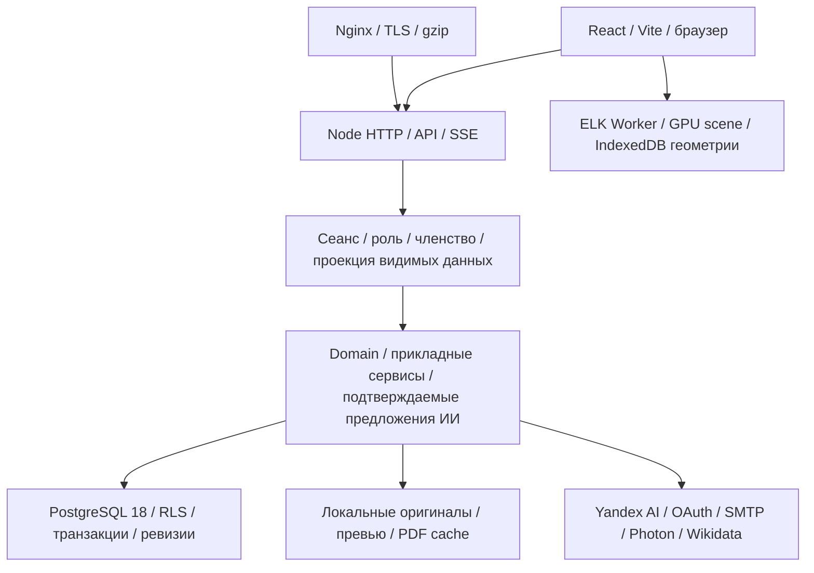

# Полный технический аудит Drevo — 9 октября 2026

Исправления выбранных замечаний A01, A02, A03, A05 и A06 описаны отдельно в
[отчёте исправлений](audit-fixes-2026-10-09.md). Ниже сохранён исходный результат
аудита: он не является утверждением о текущем рабочем релизе.

## Executive summary

Проверен `main` на коммите `2ca2e0a3eb86b4f2a1148b9d0bbf612da6de5126`, соответствующем рабочему релизу `2ca2e0a3eb86b4f2a1148b9d0bbf612da6de5126-1`. Аудит выполнен в отдельном worktree. Исходники приложения, production-данные, конфигурация сервера и резервных копий не изменялись.

Проект пригоден для ограниченного семейного сервиса с контролируемым доступом. Готовность к массовой регистрации, большим архивам и существенной параллельной нагрузке пока не подтверждена. Переписывать backend или менять стек сейчас оснований нет. PostgreSQL уже используется в production; повторная миграция не нужна.

Выявлено **12 замечаний: 1 HIGH, 9 MEDIUM, 2 LOW**. Это смесь воспроизведённых дефектов, измеренных ограничений, эксплуатационных рисков и технического долга; их тип указан ниже. Высокий риск — известное хранение рабочих данных и локальных копий на одном диске. Резервные копии ранее исключены владельцем из исправлений; здесь они проверены только чтением.

Новые воспроизводимые дефекты: исчерпание пула соединений при сочетании фоновых блокировок; падение интерфейса на повреждённой внутренней ссылке ИИ; неверное управление клавиатурным фокусом раскрытого графа. Отдельно обнаружен нестабильный браузерный тест хронологии. Массового исчезновения анимаций в проверенных сценариях не воспроизведено.

В проверенных цепочках не найдены подтверждённые CRITICAL/HIGH уязвимости авторизации, SQL injection или XSS. Это результат конкретных проверок, а не гарантия отсутствия всех уязвимостей.

## Объём, метод и ограничения

Инвентаризированы 546 TS/TSX-модулей и 63 Markdown-документа в `docs` — 9 396 строк, отдельно README и AGENTS. Построен граф локальных runtime-импортов: циклических групп не найдено. Динамические импорты с вычисляемым адресом, внешние пакеты и зависимости только типов не доказываются этим анализом. Детальная проверка выполнена по пользовательским цепочкам, владельцам состояния, SQL, конфигурации и существующим тестам; количество просмотренных файлов само по себе не считается доказательством корректности.

Проверены вход/сеанс/выход, роли платформы и древа, ограниченная проекция, публичные ссылки, загрузки и выдача файлов, документы и цитаты, импорт/экспорт, конкурентные изменения, предложения ИИ, очереди, раскладка, анимации, lifecycle приложения, CI/deployment. Рабочий сервер проверялся чтением; SQL выполнялся в `BEGIN READ ONLY`. Нагрузочные атаки, платные запросы модели и изменения реальных семейных данных не выполнялись.

Не удалось проверить:

- реальные iOS/Safari и Android устройства, VoiceOver/NVDA и полное соответствие WCAG 2.2 AA;
- фактическую ёмкость production под смешанной нагрузкой медиа/ИИ/правок;
- свежую интеграционную репетицию на локальном PostgreSQL: в этой Windows-среде нет `postgres`, `psql` или Docker; отдельно проверен успешный PostgreSQL CI текущего PR;
- реальные ответы Yandex на разнообразные вопросы в этом проходе: тесты используют подставного провайдера;
- SMTP-доставку и пользовательский вход через реальные OAuth-провайдеры от начала до конца;
- импорт GEDCOM/GEDZIP в сторонний GUI «Древа Жизни», фактическое внешнее стирание Yandex Conversation/Files;
- полный RPO/RTO, восстановление после потери сервера и первый плановый production-запуск ежемесячной репетиции;
- полную историю Git специализированным secret scanner: выполнены ограниченные поиски сигнатур в коде и истории, без найденных совпадений.

## Проверки и доказательства

| Проверка                                              | Результат этого прохода                                                                                                                                                                                           |
| ----------------------------------------------------- | ----------------------------------------------------------------------------------------------------------------------------------------------------------------------------------------------------------------- |
| `npm run typecheck`, `npm run lint`                   | Успешны                                                                                                                                                                                                           |
| Полный `npm test`                                     | 1 280 случаев: 1 276 passed, 2 failed, 2 skipped; около 20 минут                                                                                                                                                  |
| Причина двух failed                                   | В новом worktree отсутствовали игнорируемые PNG наград. После копирования уже подготовленных файлов все 12 тестов `awards-catalog.test.ts` прошли; полный 20-минутный прогон повторно не запускался               |
| Дополнительный Agelong roundtrip                      | Два теста `agelong-place-context.test.ts` прошли с предоставленным архивом. В полном прогоне этот сценарий был пропущен без переменной пути                                                                       |
| Второй unit skip                                      | Проверка symlink требует Windows Developer Mode; настройка ОС не менялась                                                                                                                                         |
| Production build                                      | Успешен, Vite 8.2.2; есть предупреждения о больших ленивых chunks                                                                                                                                                 |
| `npm run test:worker`                                 | 3 passed                                                                                                                                                                                                          |
| Основные выбранные E2E                                | 151 passed, 35 skipped, без failed                                                                                                                                                                                |
| Дополнительные E2E: веер, хронология, админка         | 39 passed, 8 skipped, один сбой точности измерения высоты; отдельный повтор этого сценария passed — A12                                                                                                           |
| Ошибка дополнительного запуска до корректировки среды | Указано неверное имя переменной executable; Playwright не нашёл свой Chromium. Это ошибка запуска аудита, не дефект приложения; результаты заменены корректным запуском                                           |
| Browser/axe                                           | 11 маршрутов при 1440 px; профиль на 320/360/390/768/1024/1440/1920 px. Переполнения и console errors не найдены. Предупреждение axe о кнопках ветвей проверено отдельно — увеличенная область нажатия существует |
| `npm audit --json`                                    | 0 известных advisory для корневого lockfile, production subset и `ops/runtime` на дату проверки                                                                                                                   |
| GitHub                                                | PR #802 merged; `check`, `postgres / postgres`, `pgbackrest_restore` — SUCCESS; deploy — success                                                                                                                  |
| Production smoke                                      | `/api/health` и JS/CSS — 200, точный release ID совпадает; анонимный `/api/admin/runtime` — 403; старый домен перенаправляет на новый кодом 301                                                                   |

В E2E проверялись начальная видимость, последовательность роста, непрерывность линий, блокировка конфликтующего ввода, сворачивание ветвей, изменение режима и камеры, полёт карточек перед веером, выход из веера, мобильные сценарии, выбор и восстановление диалогов, Markdown/графы, документы, читательские настройки, цитаты и награды. Пропуски относятся к условиям конкретных тестов/устройств; они не засчитаны как passed.

Материалы: [инвентаризация](benchmarks/audit-20261009/code-inventory.json), [раскладка](benchmarks/audit-20261009/layout.jsonl), [локальные web-метрики](benchmarks/audit-20261009/web-vitals.jsonl), [UI ИИ](benchmarks/audit-20261009/ai-ui.jsonl), [модель пула](benchmarks/audit-20261009/pool.jsonl). Проверяемые скрипты: [layout-probe.mjs](benchmarks/audit-20261009/layout-probe.mjs), [pool-probe.mjs](benchmarks/audit-20261009/pool-probe.mjs). `pool-probe` не подключается к PostgreSQL: используется настоящий адаптер Drevo с подставным ограниченным пулом.

## Оценки

Оценки отражают пригодность к развитию и эксплуатации, а не процент покрытия тестами. Общая оценка не является средним арифметическим.

| Область            | Оценка |
| ------------------ | ------ |
| Архитектура        | 7/10   |
| Backend            | 7/10   |
| Frontend           | 7/10   |
| Безопасность       | 8/10   |
| База данных        | 8/10   |
| Производительность | 6/10   |
| Масштабируемость   | 4/10   |
| Надёжность         | 6/10   |
| UX/UI              | 7/10   |
| Mobile UX          | 6/10   |
| Accessibility      | 6/10   |
| DevOps             | 7/10   |
| CI/CD              | 8/10   |
| Тестирование       | 8/10   |
| Поддерживаемость   | 6/10   |
| Observability      | 5/10   |

**Общая production readiness: 6/10.** Для небольшого действующего семейного архива состояние лучше, чем для массовой публичной платформы. Ограничивают оценку устойчивость фоновых задач, отсутствие доказанного профиля нагрузки и полноценной защиты от потери хоста.

## Фактическая архитектура

Это модульный монолит, а не микросервисы. Frontend — React 19.2.6, React Flow, TypeScript 5.9.3, Vite 8.2.2. Backend — собственный Node HTTP router, без Express/Nest и ORM. `StoreDatabase` предоставляет явный асинхронный SQL PostgreSQL и локальный SQLite-адаптер. Имя `drevo.sqlite` в переменной пути служит также якорем каталога и не доказывает использование SQLite на сервере.

Основные области: семейный граф и родство; люди/союзы/связи; фото и face-дескрипторы; документы/ридер/комментарии; каталог источников; хронология/места/сводка; аккаунты и архивы; межархивная публикация и подтверждение совпадений; ИИ-диалоги/предложения; переносимые форматы и системное обслуживание.

Входы: `src/main.tsx`, `src/App.tsx`, `src/server/index.ts`. UI-маршруты — `/tree`, `/people`, `/families`, `/photos`, `/documents`, `/places`, `/insights`, `/resources`, `/account`, `/manage`, `/admin`, архивные `/a/<id>/…` и ссылки на отдельные ресурсы. Server routing собран из владельцев HTTP-областей. API описан в `docs/api.md`, но часть описаний устарела — A11.

Авторизация состоит из независимых признаков: глобальная роль платформы, тарифный допуск, владение архивом, членство/роль читателя или родственника, привязанный человек и область видимости. Предпросмотр участника дополнительно ограничивает действия. ИИ получает доступную проекцию и создаёт предложения; запись идёт через обычные прикладные проверки после ручного подтверждения.

Фоновые работы — таймеры процесса, долговечные PostgreSQL-задания очистки провайдера и локальные ограниченные очереди. Redis/Broker отсутствуют. SSE используется для ИИ; общего канала live-изменений всех редакторов не обнаружено: целостность обеспечивают ревизии и конфликтное сохранение, а не мгновенная синхронизация экранов.

Кэши: согласованные снимки архива, индекс поиска людей по ревизии, геокодинг в БД, производные файлы на диске, геометрия в памяти/IndexedDB браузера. Оригиналы и файлы ИИ — локальные. PDF декодируется отдельным дочерним процессом с общей очередью на корневой runtime.

На сервере — Nginx, systemd, Node 22.23.2, PostgreSQL 18.6. Docker применяется в CI/репетициях БД, production Node запускается системным сервисом. GitHub Actions собирает проверенный артефакт и развёртывает release. Локальный Node аудита — 22.14.0; это отличие отмечено, а не выдано за проверку точной production-среды.

## Главные риски — TOP 10

| Порядок | ID  | Риск                                                                                       | Тип                                                   |
| ------- | --- | ------------------------------------------------------------------------------------------ | ----------------------------------------------------- |
| 1       | A08 | Потеря сервера может уничтожить рабочие данные вместе с локальными копиями                 | Известный операционный риск, вне исправлений          |
| 2       | A01 | Независимые фоновые блокировки занимают все соединения, а callbacks требуют дополнительные | Воспроизведён на ограниченном подставном пуле         |
| 3       | A02 | Повреждённый href в ответе ИИ обрушает весь интерфейс                                      | Воспроизведён SSR и браузером                         |
| 4       | A05 | Полная гидратация и операции над целым графом плохо растут с размером архива               | Архитектурное ограничение                             |
| 5       | A06 | Холодная раскладка занимает секунды, пересечения остаются                                  | Измерено на синтетических графах                      |
| 6       | A04 | Очередь поиска мест может пережить срок HTTP-запроса                                       | Подтверждён механизм, время под нагрузкой не измерено |
| 7       | A07 | Снятые с карточек оригиналы продолжают занимать диск                                       | Известное намеренное ограничение GC                   |
| 8       | A09 | После перезапуска отсутствует история ресурсных метрик                                     | Подтверждено реализацией                              |
| 9       | A03 | Клавиатура управляет фоном при открытом модальном графе                                    | Воспроизведено браузером                              |
| 10      | A10 | Один AI runner совмещает несколько ответственностей и жизненных циклов                     | Технический долг                                      |

## Реестр проблем

### [A01] Фоновые session locks способны исчерпать свой PostgreSQL pool

Категория: Backend, надёжность, конкурентность.

Severity: MEDIUM.

Priority: P1.

Confidence: HIGH.

Где: `src/server/store-database.ts:222`, `src/server/platform-ai-orphan-sweep.ts:57`, `src/server/platform-ai-orphan-sweep.ts:129`, `src/server/generated-research-files.ts:70`.

Что происходит: `withSessionTaskLock` получает отдельный client, держит session advisory lock и вызывает `work()`. Контекст SQL этого client не передаётся callback. Запросы callback берут ещё одно соединение из того же pool. По умолчанию их всего три. Очистка orphan-файлов может вложенно держать два разных lock-client.

Почему это проблема: при трёх приобретённых независимых lock задачам не остаётся свободного соединения для своей полезной работы. Ограниченный timeout предотвращает вечный deadlock, но превращает выполнение в ошибку и задерживает соседние запросы.

При каких условиях проявится: наложение длительных platform/archive задач, вложенных блокировок и обычных чтений в одном runtime. Один возможный набор — orphan sweep с вложенной блокировкой generated files и независимая задача platform backups. Не каждый параллельный запрос вызывает проблему; разные runtime имеют разные pools.

Последствия: timeout подключения, отказ фоновой работы, рост ожиданий и возможные 5xx. Повреждение данных этим экспериментом не подтверждено.

Как воспроизвести: `node --experimental-strip-types docs/benchmarks/audit-20261009/pool-probe.mjs`. Настоящий адаптер с подставным pool из трёх слотов запускает три разных lock callbacks; один завершается connection timeout. Диагностический timeout 200 мс; production-настройка — 5 000 мс. Рабочая БД не используется.

Как исправить: определить владельца соединения task lock; убрать вложенное потребление слотов либо передавать согласованный client там, где это допустимо без долгой SQL-транзакции. Ограничить одновременно активные владельцы lock и обеспечить свободный слот для полезной работы. Проверить именно три одновременные задачи и вложенную очистку. Простое увеличение `max` нарушит общий бюджет БД и не исправляет первопричину.

Сложность исправления: M.

### [A02] Некорректная внутренняя ссылка ИИ вызывает ошибку всего приложения

Категория: Frontend, обработка недоверенных данных, Security.

Severity: MEDIUM.

Priority: P1.

Confidence: HIGH.

Где: `src/components/research/markdown-answer.tsx:51`, `src/server/ai-research-runner.ts:1113`, `src/server/ai-research-support.ts:548`, `src/main.tsx:115`.

Что происходит: renderer без обработки ошибки вызывает `decodeURIComponent` у фрагмента `#drevo-person-…`. Валидные percent-escape байты могут содержать некорректный UTF-8, что вызывает `URIError`. Нормализация и исправление server markers не гарантируют корректность обычного Markdown-href такого вида.

Почему это проблема: текст модели — недоверенный вход. Исключение рендера поднимается до `RootErrorBoundary`: пользователь вместо всего архива видит «Не удалось открыть архив». Перезагрузка не исправляет повреждённое содержание сообщения, если оно загружается вновь.

При каких условиях проявится: ответ или загруженная история содержит повреждённый внутренний href. Браузерное подтверждение использовало подставной ответ сервера; частота возникновения у реальной модели не измерена.

Последствия: потеря доступа к текущему UI до восстановления состояния. Это локальный сбой отображения; выполнение JavaScript, доступ к чужим данным и изменение БД не обнаружены.

Как воспроизвести: на временном архиве передать renderer внутреннюю ссылку с percent-encoded невалидным UTF-8. Проверены SSR настоящего компонента и реальный браузерный путь `done → MarkdownAnswer → RootErrorBoundary`; см. `ai-ui.jsonl`.

Как исправить: безопасно декодировать и валидировать идентификатор; неподдержанный href оставлять обычным текстом. Изолировать сбой отдельного сообщения от всего архива. Проверить повреждённые URL, неизвестные ID и повторное открытие сохранённого ответа.

Сложность исправления: S.

### [A03] Раскрытый граф объявлен модальным, но не управляет фокусом

Категория: UX/UI, Accessibility.

Severity: MEDIUM.

Priority: P2.

Confidence: HIGH.

Где: `src/components/charts/research-visual-chart.tsx:181`, `src/components/charts/research-visual-chart.tsx:222`.

Что происходит: портал создаёт `role="dialog" aria-modal="true"`; реализован Escape, но нет initial focus, удержания Tab внутри, блокировки фонового ввода и возврата фокуса. При раскрытии компактная кнопка исчезает из DOM.

Почему это проблема: объявленное модальное поведение расходится с фактическим. Пользователь клавиатуры взаимодействует с невидимым за затемнением чатом. [WAI APG](https://www.w3.org/WAI/ARIA/apg/patterns/dialog-modal/) описывает перенос фокуса в модальный диалог, внутренний цикл Tab и возврат после закрытия.

При каких условиях проявится: открыть граф клавиатурой и нажать Tab. В свежем browser probe active element сначала стал `body`, затем — кнопкой прикрепления файлов позади окна.

Последствия: потеря контекста, недоступность управления схемой ожидаемым порядком, ошибочные действия в фоне.

Как воспроизвести: запросить граф у подставного провайдера, сфокусировать «Развернуть схему», Enter, Tab; см. `ai-ui.jsonl`.

Как исправить: использовать согласованный modal lifecycle: initial focus, inert фон, цикл Tab/Shift+Tab, Escape и возврат к логичному доступному инициатору. Добавить браузерный сценарий с клавиатурой; не ограничиваться наличием ARIA-атрибутов.

Сложность исправления: S.

### [A04] Очередь геокодинга не имеет общего срока ожидания запроса

Категория: Backend, внешние сервисы, API, надёжность.

Severity: MEDIUM.

Priority: P2.

Confidence: HIGH.

Где: `src/server/geocoding.ts:23`, `src/server/geocoding.ts:61`, `src/server/places-http.ts:83`, `ops/nginx.conf:227`.

Что происходит: до 32 различных запросов последовательно проходят через `tail`. У каждого внешнего обращения timeout 10 секунд и интервал 1,2 секунды. Один поиск может обратиться к Photon и дважды к Wikidata, включая повтор maxlag. Общего deadline для места в очереди и отмены по закрытию HTTP-клиента нет. Обычный proxy timeout — 60 секунд.

Почему это проблема: ограничение длины очереди ограничивает память, но не время ответа. Поздний запрос может ждать дольше proxy deadline даже при исправных внешних сервисах. Суточный счётчик и очередь принадлежат отдельному runtime, а не всей платформе/провайдеру.

При каких условиях проявится: несколько разных непопавших в кэш названий одновременно, медленная Wikidata, несколько архивов/процессов. Это оценка по коду; 32 поисковых запроса в production не запускались.

Последствия: timeout в браузере, бесполезная работа после отключения пользователя, повторные запросы и задержка открытия других архивов при удержании runtime lease.

Как воспроизвести: изолированный тест с подставным медленным fetch и несколькими уникальными названиями; замерять очередь отдельно от внешнего fetch. Кэш, объединение одинаковых запросов и лимит 32 уже существуют и должны сохраниться.

Как исправить: end-to-end deadline, отмена ожидающих заданий, быстрый ответ busy/Retry-After, общий бюджет внешнего провайдера при нескольких runtime. Не увеличивать вслепую nginx timeout. Отдельно отображать временную недоступность Wikidata, сохраняя найденные Photon-варианты.

Сложность исправления: M.

### [A05] Начальная порционная загрузка всё равно гидратирует весь архив

Категория: Frontend, Backend, Performance, масштабирование.

Severity: MEDIUM.

Priority: P2.

Confidence: HIGH.

Где: `src/data/archive-pages.ts:66`, `src/hooks/useArchive.ts:118`, `src/server/archive-read-cache.ts:22`, `src/server/database.ts:396`.

Что происходит: после облегчённого графа клиент обязательно получает все подробности людей и все метаданные фото, четырьмя запросами по 40 элементов. Общий срок начальной загрузки — 60 секунд. Конфликт токена переключает загрузку на полный `/api/family`. Полный snapshot копируется через JSON.parse для вызывающего. Запись меняет только нужные SQL rows, однако валидация, сравнение и история оперируют целым Family; история хранит до 50 полных снимков.

Почему это проблема: pagination уменьшает отдельный ответ, но не общий объём/работу. Для 10 000 людей требуется 250 страниц подробностей, не считая фото. Например, при последовательных четырёхзапросных группах это 63 сетевых этапа; реальное время зависит от сети и сервера. Большие детали передаются даже пользователю, который открыл одну карточку.

При каких условиях проявится: большой разрешённый архив, длинные биографии/цитаты, много фото, медленная сеть, одновременные правки и всплеск читателей. Сейчас малый архив работает; невозможность уложиться в 60 секунд на конкретном production-объёме не доказана.

Последствия: большой трафик, RAM и JSON CPU; задержка готовности редактора, дорогой fallback и линейная работа под архивной write lock.

Как воспроизвести: временный архив на техническом пределе, ограничение RTT/полосы, запись параллельно гидратации; считать transferred bytes, память, повторную выдачу и время до готовности редактирования. Не использовать миллион людей в одном графе: действующий лимит 10 000.

Как исправить: сохранить полный лёгкий граф для геометрии, загружать подробности выбранных людей и фото по потребности, отдельно готовить данные полного экспорта/анализа. Затем измерить возможность дельт истории и частичной валидации записи с сохранением общей проверки целостности. Не устранять защиты revision/pageToken ради ускорения.

Сложность исправления: L.

### [A06] Холодная раскладка остаётся дорогой и не устраняет все пересечения

Категория: Performance, UX, алгоритмы.

Severity: MEDIUM.

Priority: P2.

Confidence: HIGH.

Где: `src/domain/union-layout.ts:747`, `src/domain/union-layout.ts:769`, `src/components/tree/use-tree-layout.ts`; данные — `docs/benchmarks/audit-20261009/layout.jsonl`.

Что происходит: несколько ELK seeds и профилей повторяют layout, сравнивая качество. Измерены 7 вызовов для 66/194/202 людей и 4 для 977. Полное время — 1,22/4,35/3,08/4,81 секунды. В 977-person fixture счётчик routingQuality зарегистрировал 4 985 пересечений разных семейных групп; дополнительных связей в тесте нет.

Почему это проблема: кэш ускоряет повтор, но холодное открытие, изменившаяся топология и новый scope всё ещё требуют расчёта. Число пересечений — диагностическая метрика конкретного синтетического графа, не число визуально различимых дефектов реального архива и не доказательство, что все пересечения устранимы.

При каких условиях проявится: новый браузер/кэш, смена топологии/области, сложные повторяющиеся союзы и межветвевые связи. Измерено на Ryzen 9 5950X, Node 22.14.0, Windows, без browser CPU throttling; время смартфона не измерялось.

Последствия: секунды ожидания геометрии и трудночитаемые сложные графы. Потерянных людей или нечисловых координат в четырёх замерах нет; Worker не равен блокировке основного UI на всё это время.

Как воспроизвести: `node --experimental-strip-types docs/benchmarks/audit-20261009/layout-probe.mjs`. Это прямой холодный расчёт domain; не benchmark всей страницы.

Как исправить: поставить измеримый бюджет холодного layout и сравнивать изменение качества за дополнительный проход. Сохранять geometry cache и стабильность карточек; профилировать отмену устаревших задач, инкрементальную область пересчёта и повторное использование результата по topology/scope. Менять алгоритм только на наборе fixtures с метриками пересечений, card hits, дрейфа и времени. Не обещать планарность произвольной генеалогии.

Сложность исправления: L.

### [A07] PostgreSQL GC оригиналов отключён: физический диск может расти после удаления ссылок

Категория: Storage, надёжность, privacy.

Severity: MEDIUM.

Priority: P2.

Confidence: HIGH.

Где: `src/server/media-gc.ts:138`, `src/server/media-originals.ts:17`, `src/server/derived-cache-maintenance.ts:12`, `docs/runtime-observability.md:50`.

Что происходит: очищаются производные превью/манифесты, но PostgreSQL-оригиналы сохраняются намеренно, пока не проверены ссылки всех архивов, истории и копий. Удаление карточки или ссылки на фото не означает физическое удаление старого файла.

Почему это проблема: пользовательский объём актуальных данных и физический объём диска расходятся. Импорты, замены портретов и удаления способны увеличивать диск без роста текущего дерева. Это известный компромисс сохранности, не новая регрессия и не основание запускать SQLite GC на PostgreSQL.

При каких условиях проявится: длительная работа, частые замены/импорты и ограниченный диск. Заполненного диска или большого количества доказанных orphan-файлов сейчас не обнаружено.

Последствия: отказ новых загрузок, давление на диск и более длительное физическое хранение прежних пользовательских данных.

Как воспроизвести: только временный архив — загрузить оригинал, убрать актуальную ссылку, пройти срок истории и проверить физическое наличие. Для production сначала строить read-only инвентаризацию ссылок.

Как исправить: отчёт физического расхода и dry-run mark/sweep, отдельные корни живых данных/истории/удерживаемых копий, период защиты и безопасная повторная проверка перед удалением. Поскольку копии исключены из текущих исправлений, destructive GC до согласования их retention не включать.

Сложность исправления: L.

### [A08] Рабочие данные и локальные резервные копии имеют общий отказ диска

Категория: DevOps, Backup/DR, потеря данных.

Severity: HIGH.

Priority: P1.

Confidence: HIGH.

Где: `docs/postgres-migration.md:237`, конфигурация `/etc/pgbackrest/pgbackrest.conf` рабочего сервера — `repo1-path=/var/lib/pgbackrest`; файловые данные — тот же системный диск.

Что происходит: проверенная локальная схема хранит PostgreSQL repo и рабочие файлы на одном хосте/диске. В просмотренной конфигурации pgBackRest удалённого repo-host/type не обнаружено. Наличие ранее скачанных владельцем независимых копий не проверялось.

Почему это проблема: локальный PITR помогает при логической ошибке, но не при потере диска/сервера или компрометации хоста. Это ранее известный и согласованный локальный этап.

При каких условиях проявится: потеря диска, сервера или доступа к его данным.

Последствия: потенциальная потеря рабочей БД, WAL и оригиналов вместе с локальными копиями. Не требуется сценарий эксплуатации уязвимости: это отказ инфраструктуры.

Как воспроизвести: разрушительную проверку не выполнять. Общий failure domain подтверждён конфигурацией и `df`.

Как исправить: независимое хранилище БД/WAL и оригиналов, восстановление именно с него и внешняя проверка состояния. Полный RPO/RTO определить после репетиции пары БД+медиа+переключение приложения.

Сложность исправления: M/L. **Вне разрешённых исправлений резервных копий; аудит не меняет это ограничение.**

### [A09] Ресурсные метрики не сохраняются между перезапусками

Категория: Observability, SRE.

Severity: MEDIUM.

Priority: P2.

Confidence: HIGH.

Где: `src/server/request-metrics.ts:4`, `docs/runtime-observability.md:10`, `.github/workflows/uptime.yml:4`.

Что происходит: admin runtime показывает RAM/CPU, pools/очереди/ответы только текущего процесса. Перезапуск обнуляет историю, два процесса не агрегируются. GitHub health каждые пять минут проверяет доступность, но не историю исчерпания pool, disk pressure или длительности очереди.

Почему это проблема: после короткого сбоя/OOM нельзя по этим счётчикам восстановить развитие перегрузки. Request/access logs помогают расследовать HTTP, но не заменяют временной ряд ресурсов. Реальная доставка уведомлений владельцу не подтверждена.

При каких условиях проявится: короткий всплеск, перезапуск, несколько процессов и фоновые таймауты A01/A04.

Последствия: позднее обнаружение и поиск причины по неполному снимку. Расследование доступа и последовательности запросов возможно по существующим логам, но ресурсная причина может потеряться.

Как воспроизвести: на временном сервере сравнить metrics до/после перезапуска; значения сбрасываются по реализации.

Как исправить: небольшой внешний сборщик исторических метрик с instance/release ID; сохранять waiting/limit, latency, 5xx/503, RSS, свободный диск и queue age. Проверить доставку одного уведомления, затем определить пороги по измерениям. Не включать имена людей или токены в labels.

Сложность исправления: M.

### [A10] AI runner объединяет оркестрацию, контекст, эвристики ответа и инструменты

Категория: Архитектура, технический долг, поддерживаемость.

Severity: MEDIUM.

Priority: P3.

Confidence: HIGH.

Где: `src/server/ai-research-runner.ts:134`, `src/server/ai-research-runner.ts:231`, `src/server/ai-research-runner.ts:482`, `src/server/ai-research-runner.ts:1113`.

Что происходит: один `runResearch` охватывает получение контекста/вложений, готовые ответы на отдельные намерения, выбор разрешённых tools, построение provider request, цикл tool calls, предложения/файлы, проверенные таблицы/схемы и humanization текста. Функция занимает основную часть модуля примерно в 1 930 строк. Причина замечания — перечисленные разные ответственности, а не число строк само по себе.

Почему это проблема: изменение поведения ответа затрагивает provider lifecycle и путь применения прав; существенные зависимости передаются через общие локальные переменные. Трудно изолировать проверки намерения, результата инструмента и итерации провайдера. Имеющиеся `ai-research-support` и отдельный Responses client уже уменьшают связанность, но граница остаётся широкой.

При каких условиях проявится: новые инструменты/форматы ответов, восстановление диалога, смена поведения provider или новые режимы доступа. Сейчас это технический долг; отдельного сбоя из-за размера функции не заявляется.

Последствия: больший риск регрессии и стоимость проверки одной возможности.

Как воспроизвести: проследить путь одного запроса от `proposalRequested` через allowed tools до финального `safeAnswer`; модуль владеет всеми перечисленными стадиями.

Как исправить: выделить конкретные владельцы построения requester context, dispatch прикладных инструментов и форматирования проверенного результата. Runner оставить владельцем последовательности turn/abort/provider state. Сохранить текущие access guards и регрессии. Не создавать универсальный DI/framework или новый transport.

Сложность исправления: M/L.

### [A11] README, API и roadmap описывают часть уже изменённых контрактов

Категория: Документация, технический долг.

Severity: LOW.

Priority: P3.

Confidence: HIGH.

Где: `README.md:39`, `README.md:78`, `README.md:139`, `docs/api.md:30`, `docs/roadmap.md:99`, `ops/postgres/097_document_citation_index.sql:2`.

Что происходит: README одновременно описывает platform backup с выбором архива и ниже — без него; ограниченный доступ назван прежним режимом и неполно перечисляет партнёров/со-родителя. В API-таблице остаются прежние settings/SQLite backup формулировки. Roadmap откладывает индекс обратных цитат, который уже создан миграцией 097 и используется `document-citation-query.ts`.

Почему это проблема: разработчик может повторно выполнять завершённую задачу или применять устаревший контракт. Чистый checkout по README не подготавливает игнорируемые PNG наград: это вызвало два фактических сбоя аудита, хотя CI отдельно выполняет `fetch-award-images.sh`.

При каких условиях проявится: новый checkout, агент начинает работу по docs, оператор использует прежнюю инструкцию.

Последствия: потеря времени, неверные ожидания прав/настроек и ложное заключение о сломанных тестах.

Как воспроизвести: сопоставить перечисленные строки с нынешним UI/SQL; `npm test` в checkout без подготовленных PNG падает в каталоге наград.

Как исправить: согласовать README/API/roadmap с кодом, явно описать prerequisites подготовки assets и активный PostgreSQL runtime. Перенести завершённый индекс в историю; прежние audit-отчёты оставить датированными доказательствами, не переписывать их как текущий статус.

Сложность исправления: S.

### [A12] Тест высоты строки хронологии нестабилен на дробной геометрии браузера

Категория: QA, CI, качество тестов.

Severity: LOW.

Priority: P3.

Confidence: HIGH.

Где: `tests/e2e/horizontal-timeline.spec.ts:169`.

Что происходит: измеренный `getBoundingClientRect().height` сравнивается строго с 64. В проходе получено 64,00003051757812; отдельный повтор прошёл.

Почему это проблема: разница в 0,00003 CSS px не является видимой регрессией, но делает сборку красной. Сценарий иначе проверяет полезные свойства: эпохи, drag, события, портрет и будущее.

При каких условиях проявится: дробные transforms/анимация/вычисления координат конкретного браузера.

Последствия: ложные отказы CI и недоверие к регрессиям интерфейса.

Как воспроизвести: выбранный desktop E2E в дополнительном проходе; точное значение сохранено в логе аудита. Повтор не гарантирует сбой.

Как исправить: дождаться завершения значимой анимации и использовать обоснованный допуск для CSS-геометрии, сохранив проверку компактности. Не скрывать настоящий рост строки увеличением допуска на десятки пикселей.

Сложность исправления: XS.

## Security

Проверка ориентирована на актуальный [OWASP Top 10:2025](https://top10.owasp.org/2025/0x00_2025-Introduction/). **CRITICAL: 0; HIGH: 0; MEDIUM: 1 — A02; LOW: 0.** Счётчик относится к подтверждённым security-замечаниям этого прохода. HIGH A08 относится к disaster recovery, а не к найденному обходу авторизации.

| Цепочка                                | Что проверено / результат                                                                                                                                                                                                                                                                                   |
| -------------------------------------- | ----------------------------------------------------------------------------------------------------------------------------------------------------------------------------------------------------------------------------------------------------------------------------------------------------------- |
| Login → session → cookie → logout      | Random token, hash в хранилище, HttpOnly/SameSite=Lax, Secure для HTTPS, expiry/renewal, серверный отзыв; OAuth state/PKCE и одноразовое состояние. Не найден путь выдачи session token во frontend bundle                                                                                                  |
| Email                                  | scrypt, ограничение пароля/размера, одноразовые verify/reset токены, dummy hashing и лимиты. Реальная доставка выключенного email-входа не проверена                                                                                                                                                        |
| Reader/relative/owner → API            | UI-скрытие подкреплено серверными проверками; глобальная роль и полный тариф не заменяют членство. Preview не даёт редактирование/платформенные настройки                                                                                                                                                   |
| Blood scope → search/media/export/AI   | Используется общая проекция разрешённых людей, партнёров и нужного со-родителя; добавленные участником карточки учитываются отдельно. Отзыв проверяется перед чувствительной выдачей и записью                                                                                                              |
| Archive → PostgreSQL                   | 62 таблицы с ENABLE/FORCE RLS; production `site_drevo` не superuser и не BYPASSRLS. Специальная backup-роль отделена и не считается runtime-обходом. Обходные свойства владельцев/привилегированных ролей описаны в [документации PostgreSQL](https://www.postgresql.org/docs/current/ddl-rowsecurity.html) |
| SQL / command / XML / paths            | Проверены параметризованные значения SQL, перечислимые имена сущностей, filesystem root checks, signature/type ограничения и XML parser. Подтверждённых injection/traversal/XXE не найдено; destructive fuzz не проводился                                                                                  |
| Markdown / Mermaid / charts            | Нет произвольного raw HTML; KaTeX trust=false; Mermaid directives ограничены, SVG санитизируется; ECharts tooltips используют richText. Осталась ошибка декодирования A02, не XSS                                                                                                                           |
| Upload → reservation → filesystem → DB | Ограничения байтов/пикселей, атомарные квоты/резервирование, staging, контроль видимости оригинала. ZIP/PDF распаковка и decoder имеют собственные границы; PDF heap limit не равен общему RSS limit                                                                                                        |
| HTTP                                   | Nginx CSP, HSTS, nosniff, frame-ancestors, referrer/permissions policy; same-origin guards для mutations, приватные no-store ответы. Отсутствующий Origin сам по себе не признан CSRF: учтены cookie SameSite и Sec-Fetch-Site                                                                              |
| API abuse                              | Bounded archive/PDF/preview queues, body/file caps, account/tier/AI budgets и rate limits. Сквозной профиль при одновременных нагрузках отсутствует; геопоиск — A04                                                                                                                                         |
| Secrets / supply chain                 | Конфигурационные секреты не возвращаются UI; зашифрованное provider подключение; выбранные сигнатуры в source/history без совпадений. npm advisory=0 не проверяет каждый transitive install script и не доказывает отсутствие неизвестной CVE                                                               |

Критические старые замечания не перенесены механически. Sharp обновлён до 0.35.5; streaming restore и ограничения decoder/пулов уже присутствуют; lease активной работы runtime учитывается отдельно от закрытия HTTP-клиента. Их прежние отчёты остаются историческими документами.

## База данных, целостность и API

На production чтением подтверждён **PostgreSQL 18.6**. В точном count-снимке: два архива, 164 человека, 99 фото, 13 документов. Это снимок во время аудита; последующий `pg_stat_user_tables` не является точным повторным count. `max_connections=30`, `shared_buffers=128 MB`, `work_mem=2 MB`. В pool задан statement timeout 15 секунд, хотя общий SQL `SHOW statement_timeout` равен нулю: это не отсутствие timeout у приложения.

Схема использует архивные составные ключи/FK/cascade/RLS, отдельные relations/unions/tags/documents и JSONB данных человека. JSONB позволяет сохранять варианты/источники и гибкие сведения, но переносит часть целостности на domain validation и прикладной write path. Нельзя выдавать гибкую JSONB-схему за полностью типизированные SQL-колонки всех полей.

`withPostgresArchiveWrite` блокирует архив, затем права/сеанс в согласованном порядке, проверяет ревизию и использует lock/statement timeout. Два редактора не делают last-write-wins молча: независимые поля объединяются, конфликт одного поля показывается пользователю. Ограничение — сериализация записи внутри одного архива и обработка полного Family, A05. В обычных изменениях `syncArchiveRows` обновляет различающиеся rows: заявления «каждый клик удаляет и вставляет все таблицы» не подтверждены.

Индекс обратных цитат документов уже существует — миграция 097, PK по `(archive_id, document_id, kind, entity_id)` и обратный индекс сущности. Старый JSON-scan нельзя записывать как нынешний PostgreSQL-bottleneck этой операции. Поиск людей строит компактный индекс по ревизии; это не N+1 на каждый введённый символ. Admin account list использует keyset pagination, а substring-поиск при большом числе аккаунтов остаётся линейным — будущий кандидат измерения, сейчас дорогой production-plan не доказан.

| Размер                       | Применимость и прогноз                                                                                                                                                                                                    |
| ---------------------------- | ------------------------------------------------------------------------------------------------------------------------------------------------------------------------------------------------------------------------- |
| 10 000 людей в архиве        | Технический предел. Нужно проверить RAM/геометрию/гидратацию/запись целого графа; наличие SQL-индексов не решает A05/A06                                                                                                  |
| 100 000 людей                | В одном древе недопустимо текущим контрактом. Применимо как сумма архивов платформы: важнее runtime churn, индексы archive_id, storage и общий бюджет pools                                                               |
| 1 000 000 / 10 000 000 строк | Возможны в суммарной платформе/аудите/служебных таблицах. EXPLAIN на таких рабочих объёмах не выполнялся; точные latency/IO не заявляются. Нужен отдельный изолированный PG benchmark и retention соответствующей таблицы |

CRUD/restore/import/export: проверены обычный create/update/delete, parent/spouse integrity, подтверждённые AI writes, цитаты/награды, page token при concurrent edit, атомарные квоты и неполное выполнение загрузки. Восстановление проходит preview/валидацию/подтверждение; сохранность текущих прав при восстановлении архива проверяется PostgreSQL CI. Настоящее destructive restore production не запускалось.

GEDCOM 5.5.1/7 и GEDZIP сохраняют birth surname как BIRTH; импорт принимает BIRTH и прежний MAIDEN. Источники URL/NOTE и координаты мест представлены соответствующим exporter-кодом и внутренними roundtrip tests. Это не доказательство идентичного отображения в сторонней программе. XML-экспорт удалён; XML-импорт Agelong — отдельный поддерживаемый путь.

API в целом согласован с UI и имеет revision/conflict/error статусы, request IDs, явные лимиты и paging. Контракт полного Family тесно связан с JSON-моделью — A05. Общего внешнего versioned API/OpenAPI нет; для приложения с совместным релизом client/server это техническое решение, не самостоятельный P1-баг. MCP отсутствует по продуктовому решению. Идемпотентность и повторный accept предложения защищены состоянием/транзакцией, а не только отключённой кнопкой.

## Performance и масштабирование

**Измерено:** холодный domain layout на четырёх воспроизводимых графах; маленький production frontend с синтетической SQLite-БД в localhost. **Не измерено:** смешанный production throughput, CPU/RAM на 100/1 000/10 000 реальных одновременных пользователей.

| Граф     | ELK вызовы | Холодный layout | Пересечения routingQuality |
| -------- | ---------- | --------------- | -------------------------- |
| 66 людей | 7          | 1 218 мс        | 16                         |
| 194      | 7          | 4 347 мс        | 217                        |
| 202      | 7          | 3 083 мс        | 193                        |
| 977      | 4          | 4 808 мс        | 4 985                      |

RSS последовательного Node-процесса достиг 249 MiB после последнего расчёта; это не browser heap и не peak отдельного fixture. Время и качество сильно зависят от структуры, поэтому увеличение числа людей не даёт линейной формулы latency.

В 6-person localhost fixture: desktop TTFB 3 мс, LCP 516 мс, CLS ≈0,000001; 390 px — TTFB 3 мс, LCP 392 мс, CLS 0,00355. Выполнено по одному запуску; без сети/CPU throttling, без Nginx compression. Это диагностические наблюдения, не оценка production Core Web Vitals. INP и полевые P75 не измерены. Начальная страница загрузила около **1,03 MB декодированного JS**, 37 JS-ресурсов; это не gzip-трафик на сервере.

Большие chunks ленивые: Human 1,56 MB / gzip 409 KB, ECharts 593 KB / 202 KB, discussion 538 KB / 188 KB, tree PDF 498 KB / 159 KB, BookReader и Mermaid-related chunks. Размер chunk сам по себе не доказывает, что всё входит в первый экран. Проверять нужны конкретные waterfalls выбранных функций и бюджет при слабом телефоне; произвольный manualChunks может ухудшить порядок загрузки.

Текущие bottleneck: первый layout, сложные пересечения, JSON-копии больших снимков, очереди обработчиков медиа/геопоиска, сочетание task locks. При росте добавятся full hydration/история, диск оригиналов, лимит активных архивов и общий connection budget.

Nginx использует TLS 1.2/1.3, HTTP/2 и gzip. Brotli/HTTP/3/CDN в просмотренной конфигурации не обнаружены; их отсутствие не признано багом. Static release assets и private API/media требуют разных cache policies; хранить приватную выдачу в общем CDN без проверки доступа недопустимо. Начальный HTML и ресурсы проверены; реальный CDN/edge cache benchmark не выполнялся.

На production в спокойном снимке: RAM 3 398 MiB, доступно 2 608 MiB, swap 2 047 MiB (занято 48 MiB), service cgroup около 578 MiB; диск 30 GB, свободно около 13 GB, заполнение 55%. `MemoryMax=infinity`; service hardening `NoNewPrivileges`, `PrivateTmp`, `ProtectSystem=strict`, `ProtectHome` включён. Это не обещание допустимого количества пользователей.

| Одновременно | Оценено по архитектуре                                                                                                                                                                  |
| ------------ | --------------------------------------------------------------------------------------------------------------------------------------------------------------------------------------- |
| 1            | Основные сценарии проверены; холодное сложное древо всё равно может ждать секунды                                                                                                       |
| 10           | Малые кэшированные чтения выглядят допустимыми, но десять cold PDF/разных архивов/ИИ — другой профиль: есть bounded очереди и 503. Параллельные фоновые задачи могут раньше выявить A01 |
| 100          | Без измерения обещать throughput нельзя. Вероятны pool waiting, JSON CPU, очередь новых архивов и ограничения медиа. Записи одного архива сериализуются                                 |
| 1 000        | Текущая малоресурсная однохостовая конфигурация не подтверждена для такой нагрузки. Вероятны admission/timeout/503 и RAM/диск bottleneck раньше предела самого PostgreSQL               |
| 10 000       | Готовность отсутствует. Требуются профиль пользователей/запросов, staged load benchmark и изменения владельцев runtime/storage, а не механическое добавление processes                  |
| Всплеск      | Холодные cache/runtime и тяжёлые endpoints опаснее равного числа бездействующих открытых вкладок. Ограничения queue защищают память отказом, но не обеспечивают низкую latency          |

Root плюс три scoped runtime — до 12 PG connections на процесс; два процесса — до 24 при 27 обычных доступных слотах. `archiveRoutePool` допускает очередь 32 и ожидание idle до пяти секунд. Длительные SSE/файловые работы удерживают runtime намеренно; при множестве архивов возможен быстрый 503. Это граница вместимости, не ошибка authorization.

Несколько процессов на одном хосте поддерживаются общими PostgreSQL-правами/locks и shared directory, но счётчики/геокодинг/кэши/очереди частично процессные. Горизонтальные backend-хосты нельзя считать готовыми: нужны общие оригиналы/derived caches и распределённые бюджеты провайдера/задач. Добавление sticky sessions не решает общую файловую систему. PgBouncer в transaction mode нельзя подключать вслепую: текущие session advisory locks имеют другую семантику.

## UX/UI, мобильность, Accessibility и SEO

Действующий UI значительно компактнее ранних описаний. На просмотренных экранах шапка/админская sidebar/карточка согласованы, аватарка справа не смещалась, вкладки профиля не разъезжались, 320 px не дали горизонтальное переполнение. Нужды снова полностью переписывать админку по этим данным нет.

| Приоритет интерфейса | Конкретное изменение                                                                                                                                 |
| -------------------- | ---------------------------------------------------------------------------------------------------------------------------------------------------- |
| A02                  | Ошибка оформления одного ответа должна оставлять древо и остальные сообщения доступными                                                              |
| A03                  | Клавиатурный lifecycle раскрытой схемы: вход, внутренний Tab, Escape, возврат                                                                        |
| A06                  | Для первого расчёта большого scope сохранить понятное состояние ожидания и стабильную анимацию; оптимизировать время без появления карточек до линий |
| A04                  | Сообщать об ожидании/занятости поиска раньше proxy timeout; найденные варианты не исчезают из-за исторического сервиса                               |
| A12                  | Защитить регрессии от ложного падения на дробном CSS px                                                                                              |

Открытие/закрытие документов, выбор человека с фото, editor sources/awards, viewer width, reader preferences и движения карточек проверены E2E. Дополнительный тест полёта карточек перед веером прошёл на desktop/mobile. Мобильный набор — Chromium/Pixel 5 emulation; он не воспроизводит системные жесты Safari или скорость реального телефона.

Автоматический axe на проверенных страницах не нашёл подтверждённых новых ошибок, кроме проверенного false positive о визуальном размере branch pill. CSS pseudo-element расширяет область нажатия с поправкой на zoom; отдельные control-target E2E прошли. Графы и диаграммы уже имеют текстовую ARIA-проекцию names/edges/values; заявление «Canvas полностью недоступен скринридеру» было отклонено после чтения `visualLabel` и `ai-token-usage-chart`.

Полная проверка контраста всех состояний, touch hit testing физического устройства, live announcements, reduced motion и screen reader отсутствует. A03 — подтверждённый дефект; остальные непроверенные пункты не оформлены как найденные нарушения WCAG.

Основная часть сервиса — приватный семейный архив: SEO персональных данных не является требованием и не должно включаться автоматически. Общие title/description/OG/favicon есть. Публичные/межархивные выдачи и sharing имеют noindex guards. SSR карточек, sitemap и индивидуальные OG не реализованы как отдельный доказанный продуктовый сценарий; их отсутствие не требует P1-исправления для приватного приложения.

## Надёжность, логирование, DevOps и CI/CD

При недоступной БД запросы имеют ошибки/таймауты, health читает её состояние. Медленные writes ограничены statement/lock timeout; конфликты не скрываются. Медленные внешние сервисы ограничены timeout/retry, но ожидание геопоиска неполное — A04. Продолжение AI turn после закрытия вкладки учитывается runtime lease; не следует снова отменять его из-за обычного переключения диалога.

Повреждённые PDF, диапазоны страниц и большие документы проверялись browser tests. Декодер ограничен deadline 25 секунд и V8 old-space 192 MiB, один активный на корневой процесс, восемь pending, ожидание слота пять секунд. Это heap bound, не абсолютный RSS sandbox. Диск защищён резервированием свободного места и staging, но дальнейший retention оригиналов — A07. Graceful shutdown ограничен сроком: бесконечное сохранение work после restart не обещается.

JSON request logs содержат request ID, безопасный route/status/duration, Nginx access log скрывает share/invite tokens и query. Аудит семейных изменений существует отдельно. Авторские snapshots после удаления аккаунта обезличиваются согласно retention-контракту; это не стирает любой произвольный текст биографии. Не найдено необходимости добавлять второй общий logger ради формы вывода; нужна история метрик A09 и доказанная доставка оповещения.

CI не ограничен lint: typecheck, unit, E2E, built Worker, npm audit, shell/nginx checks, PostgreSQL integration и restore smoke. Actions закреплены commit SHA. Защита `main` реально требует `check` и `postgres / postgres`, `enforce_admins=true`. Deployment дополнительно выполняет prepare и PostgreSQL checks для выпускаемого SHA, использует verified artifact и environment production. Поэтому утверждение «плохой commit автоматически пройдёт, потому что checks только в PR» не подтверждено.

Непроверенные/недостаточные тестовые сценарии сейчас конкретны: task-lock pool starvation, malformed internal Markdown href, keyboard modality графа; реальная SMTP-доставка, сторонний GEDCOM importer, физический mobile, смешанный load profile. В остальных областях тесты уже есть; рекомендация «добавить тесты вообще» не требуется.

## Privacy и disaster recovery

Хранятся семейные ФИО/даты/биографии/родство/места, фото/документы/источники/комментарии, face-дескрипторы, учётные записи/идентификаторы провайдеров/email/сеансы, истории и ИИ-диалоги. Выдача между архивами отделена от публикации; членство не транзитивно. Публичная ссылка и публикация людей в поиске — разные разрешения.

Есть личный экспорт, отзыв сеансов, выход из древа, передача владения и удаление аккаунта/архива. Удаление не отзывает уже скачанную копию, не переписывает прежний backup и не доказывает исчезновение всех удалённых данных у Yandex. У известных Conversation/Files — долговечная cleanup queue; прежние неизвестные ID и сбой до регистрации ID остаются документированным ограничением. Реальную provider-delete семантику этот аудит не подтверждает.

Нужно резервировать PostgreSQL + WAL, оригиналы фото/портретов/документов, ключ шифрования и необходимые конфигурационные секреты. Derived previews восстанавливаемы, оригиналы — нет. Локальные restore checks не равны защите от потери хоста. Полный RPO/RTO не определён: время восстановления только PostgreSQL не включает медиа, секреты и переключение сервиса. Для потери текущего диска гарантированная независимая копия не подтверждена — A08.

## Ключевые зависимости

Версии проверены по lockfile и npm registry 9 октября. Новая major-версия не равна обязательному обновлению; отсутствие advisory не равняется гарантии безопасности.

| Библиотека                                     | Назначение / оценка                                                                                                                                                                                                  |
| ---------------------------------------------- | -------------------------------------------------------------------------------------------------------------------------------------------------------------------------------------------------------------------- |
| React/react-dom 19.2.6                         | UI; нужен. В registry есть 19.3.0; обновление отдельно с UI regression                                                                                                                                               |
| TypeScript 5.9.3 / Vite 8.2.2                  | Проверка/сборка; нужен. Latest TS 7.0.2 и Vite 8.3.4 не основание для внеплановой смены toolchain                                                                                                                    |
| pg 8.23.0                                      | PostgreSQL; нужен. Есть 8.23.1; первично исправить ownership pool A01                                                                                                                                                |
| React Flow 12.11.6 / ELK 0.12.0                | Полотно/геометрия; нужны. React Flow 12.12.0 есть; algorithm benchmark важнее слепого обновления                                                                                                                     |
| Sharp 0.35.5                                   | Серверные изображения; прежний advisory 0.35.4 не считается текущим                                                                                                                                                  |
| Human 3.3.6                                    | Браузерное распознавание лиц/векторы; большой ленивый bundle, не ради одной функции                                                                                                                                  |
| BookReader 5.0.0-117 / PDF.js 6.3.289          | Reader и PDF parsing; сложная интеграция оправдана нужным режимом книги. npm latest BookReader указывает на более старый prerelease, нельзя автоматически «обновлять» вниз; PDF.js 6.4.299 требует reader regression |
| ECharts 6.1.0                                  | Token charts и визуализации ИИ; общая библиотека используется по назначению                                                                                                                                          |
| Mermaid 11.17.2 / DOMPurify 3.4.16             | Разбор схем/санитизация; нужны. Mermaid 12.1.0 — отдельная major migration, не quick win                                                                                                                             |
| ReactMarkdown / unified / remark / rehype      | Общий Markdown/math pipeline; комплекс функций, не одно форматирование строки                                                                                                                                        |
| KaTeX 0.18.2                                   | Математика; trust=false. Есть 0.19.0; старое замечание про 0.16.x не соответствует lockfile                                                                                                                          |
| CodeMirror 6                                   | Редакторы; пакетная система оправдана Markdown editing, есть небольшие обновления                                                                                                                                    |
| jsPDF 4.2.1 / svg2pdf.js 2.8.1 / PDFKit 0.20.2 | Разные browser/server экспортные пути; не удалять как дубликаты без трассировки PDF сценариев                                                                                                                        |
| Leaflet 1.9.4                                  | Карта, отдельная lazy область; нужен                                                                                                                                                                                 |
| nodemailer 10.0.13                             | SMTP; есть 10.0.16. Реальная доставка остаётся операционной приёмкой                                                                                                                                                 |
| saxes / yauzl / yazl                           | XML import / ZIP чтение/запись; применяются в обмене, проверять лимиты и целостность, а не заменять ради единообразия                                                                                                |
| Playwright 1.63.0                              | Browser regression, есть 1.64.0. В аудите использован installed Chrome через предусмотренную env-настройку                                                                                                           |

Подтверждённых подозрительных dependencies/dependency confusion или пакета, требующего удаления ради одной небольшой функции, не найдено. Сторонние install scripts и вся provenance-цепочка не сертифицированы этим выводом.

## Технический долг и целевая архитектура

Опасный долг: A01; retention физических оригиналов A07; инфраструктурный failure domain A08. Дефект отображения A02 и фокус A03 — баги, не замаскированный «долг».

Мешающий развитию: широкий lifecycle `runResearch` A10; целый Family как единица загрузки/валидации/истории A05; холодный алгоритмический бюджет A06. Второй кандидат композиции — `documents-http.ts`: один владелец сочетает каталог, upload, reader, цитаты, комментарии/аннотации. Делить следует по этим ответственностям, после фиксации контрактных сценариев, а не механически по 300 строк.

Косметический/организационный: несогласованные docs A11 и слишком точное геометрическое assertion A12. Общих импортных циклов, большого списка TODO/FIXME или основания массово вводить интерфейсы/DI не обнаружено. Кэши/таймеры существуют как mutable state конкретного lifecycle, это не само по себе запах глобального состояния.

Целевая архитектура: сохранить React/Node/PostgreSQL и чистый domain; сузить владельцев AI turn и documents workflows, определить соединение каждой фоновой задачи, отделить лёгкий граф от on-demand деталей. После измерений — независимый storage/metrics контур и согласованный бюджет нескольких процессов. Микросервисы, переписывание на другой язык, DNA, OCR и возврат MCP в эту программу не входят.

## Quick Wins и roadmap исправлений

Сложности: XS — локальная маленькая правка; S — ограниченный компонент/контракт; M — несколько взаимодействующих модулей; L — изменение модели или нагрузочная/операционная приёмка. Это оценка объёма, не обещание календарного срока.

Quick wins: safe href handling A02 (S), keyboard modal A03 (S), CSS tolerance A12 (XS), корректировка документации/prerequisites A11 (S). A01 имеет высокий эффект, но это M с проверкой конкурентности, а не безопасный однострочный `max++`.

### Этап 0 — до ближайшего релиза

- A01: определить connection ownership и убрать starvation; воспроизведение с тремя владельцами и nested task обязательно — M.
- A02: безопасный decode, валидный resource ID и локальный message fallback; saved-chat regression — S.
- A08: высокий риск записан; работа с резервными копиями исключена прежней командой. Не закрывать этот пункт названием «локальный backup работает».

### Этап 1 — стабилизация

- A03: настоящий keyboard modal lifecycle и focus return — S.
- A04: queue deadline/cancel, shared provider budget и проверка slow upstream — M.
- A09: история метрик и проверенная доставка оповещения — M.
- A11/A12: исправить документацию и геометрический flaky test — S/XS.
- Довести ранее открытые операционные приёмки: реальные email/OAuth, сторонний importer, физический mobile. Не считать их реализованными на основании mock E2E — S/M.

### Этап 2 — производительность

- A05: профиль максимального разрешённого графа с RTT; затем details-on-demand без обхода permissions/pageToken — L.
- A06: сравнение дополнительных ELK passes по latency/quality и инкрементальности на зафиксированных fixtures — L.
- A07: read-only отчёт физического расхода, orphan candidates и корней удержания; удаления только после доказательства ссылок — M для диагностики, L для безопасного GC.
- Mixed PG/Linux benchmark: чтения, writes, cold previews/PDF, подставной AI, фоновые locks, burst; публиковать p50/p95/p99, RSS, pool waiting и процент отказов — L.

### Этап 3 — архитектура

- A10: requester context / tool dispatch / verified answer formatting, runner сохраняет turn lifecycle — M/L.
- Композиция document workflows только по устойчивым областям upload/reader/comments/citations, с прежними правами и транзакционными границами — M.
- После измерения A05 определить необходимость дельт истории; не переписывать всю JSONB-схему заранее — L при доказанной потребности.

### Этап 4 — UX/UI

- Проверить основные сценарии на реальном Android/iPhone, touch targets на нескольких zoom, системный pinch/scroll, reader и долгие жесты — M.
- Проверить NVDA/VoiceOver, focus/announcements/errors/reduced motion; исправлять подтверждённые места — M.
- Для большого cold layout сохранить понятное ожидание и card → line → card без прежнего flash; принять изменение по видео/метрикам — M.

### Этап 5 — масштабирование по результатам измерений

- Пересчитать connection/runtime budget и admission policy для числа одновременно активных архивов — M.
- Перед вторым backend-хостом обеспечить общие файлы и согласованное выполнение/лимиты фоновых задач — L.
- Расширять квоты и обещать ёмкость только после смешанного benchmark; не добавлять Redis/CDN/PgBouncer без определённого владельца и доказанного bottleneck.

## Что сделано хорошо

- Разделены платформенные полномочия, владение архивом, роль участника, тариф и область данных; доступ проверяется на сервере, включая повторные проверки после ожидания.
- PostgreSQL runtime работает без superuser/BYPASSRLS; RLS, параметризованные запросы, согласованный порядок блокировок и revision conflict обеспечивают реальные границы данных.
- Лёгкая начальная проекция, lazy routes, Worker, geometry cache и виртуализация уже снижают стоимость UI. Большой frontend не загружает все функции одним монолитным chunk.
- ИИ пишет через подтверждённые прикладные предложения, доступные tools и доменные вычисления, а не получает произвольный SQL/доступ ко всей БД.
- Файловые операции имеют staging, квоты/резервирование, контролируемые пути, подтверждённую выдачу и limits. PDF вынесен из основного процесса; производные cache имеют бюджеты.
- Реальные CI gates, branch protection для администраторов, verified release artifact и проверка release ID снижают риск непроверенного deployment.
- Есть содержательные regression tests для прав, revocation, конкуренции, целостности источников и анимаций. Найденные в аудите false positives проверены по execution path и не включены в реестр как баги.
